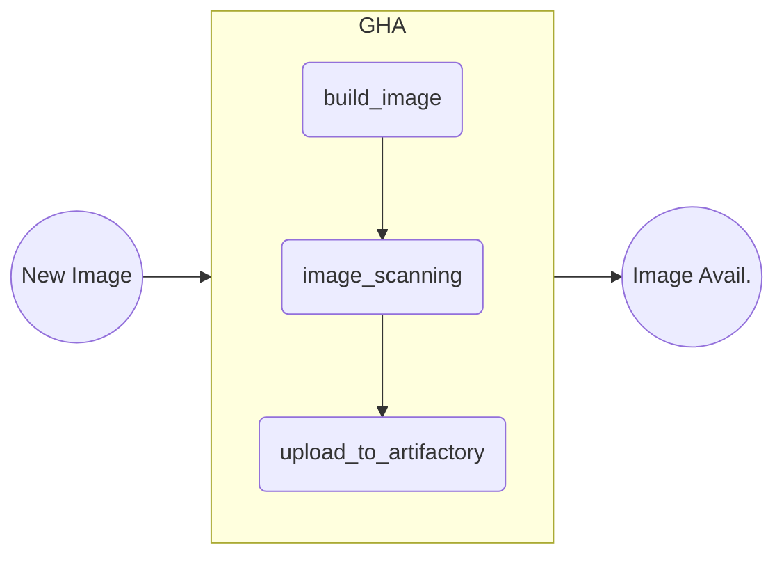

# gl-base-images
A dark, musky storage space containing base images. BEWARE!

### Flowchart

```mermaid
flowchart LR
    %% Setup
    A((New Image))
    B((Image Avail.))
    
    C(build_image)
    D(image_scanning)
    E(upload_to_artifactory)
    
    %% Sub flowchart 
    subgraph GHA
        direction TB
        C --> D --> E
    end
    
    %% Overall flowchart
    A --> GHA --> B
```